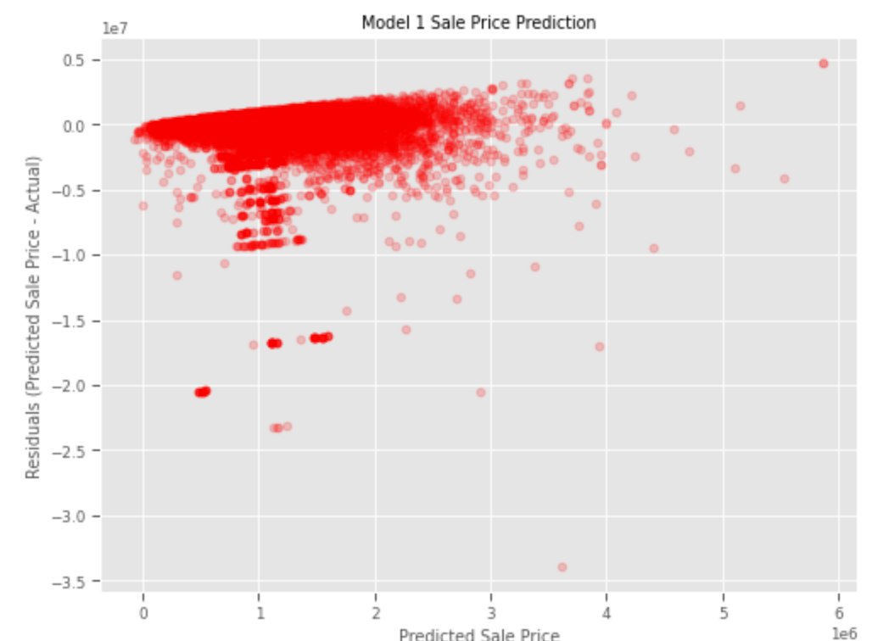

# King County Home Price Analysis

This repository offers an analysis of factors that influence housing prices in King County, WA.

## This Repository

### Repository Directory

```
├── README.md        <-- Main README file explaining the project's business case,
│                        methodology, and findings
│
├── data             <-- Data in CSV format
│   ├── processed    <-- Processed (combined, cleaned) data used for modeling
│   └── raw          <-- Original (immutable) data dump
│
├── notebooks        <-- Jupyter Notebooks for exploration and presentation
│   ├── exploratory  <-- Unpolished exploratory data analysis (EDA) notebooks
│   └── report       <-- Polished final notebook(s)
│
├── references       <-- Data dictionaries, manuals, and project instructions
│
└── reports          <-- Generated analysis (including presentation.pdf)
    └── figures      <-- Generated graphics and figures to be used in reporting
```

### Quick Links

1. [Final Analysis Notebook](notebooks/exploratory/final_notebook.ipynb)
2. [Presentation Slides](reports/presentation.pdf)


## Overview

Overview
This project analyzes sale price of homes in King County, WA in order to make recommendations to homeowners on improvements they can make to their homes to fetch a higher sell price. This analysis uses data from multiple datasets and only contains records of complete and relevant data. It also uses additional colums that were calculated using these datasets. The data analysis attempts to show the both the negative and positive relationships between Sale Price and several features, including number of bathrooms, bedrooms, total living area, and view utilization.


## Business Understanding

This data analysis aims to answer questions about home sales in King County, WA. In particular, this analysis aims to investigate, what improvements can be made to homes in order increase the selling price.

## Data Understanding

The data was displayed in a heatmap to display variables and their correlation to Sale Price. The plots of several select variables showed the was heavily skewed. To address that, extreme outliers were exluded and a log tranformation of the target variable was performed in order to normalize the data for further use in this analysis.


## Data Preparation

Parcel,  Residential, and Real Property Sales data were filtered to focus on homes that will satisfy the requirements of this project. Mobile homes and all condos were excluded to focus on one type of property. Additionally, filtering homes with at least 1 bathroom, a Sale Price greater than zero, may be helpful in this analysis.

## Modeling

The final model with the target variable Sale Price included three features: Total Living Space(SqFtTotLiving), Total Bathrooms, and ViewUtilization. 



## Evaluation

The model underwent three interations, each time investigating how well the model address the four assumptions of linear regressions: Linearity, Normality, Homoscadacity. When multuple independent variables were included, the assumption of Independence was also included. While each iteration of the model violated these assumptions, the final model showed improvement compared the second iteration in Linearity, Normality, Homoscadacity, and Independence. 

## Conclusion
The model presents that about 26% of Sale Price is attributed to View Utilization, Total Bedrooms, and Total Living Space.

- Homes that utilized their view tended to have a higher sale price.
- Homes with more bedrooms and total living space tended to have a higher sale price.
