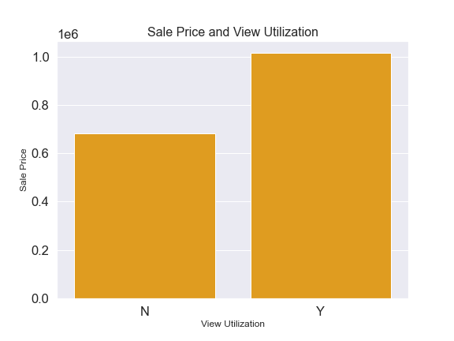

<br/>

# King County Home Price Analysis

<br/>

This repository offers an analysis of factors that influence housing prices in King County, WA.


## This Repository

### Repository Directory

```
├── README.md        <-- Main README file explaining the project's business case,
│                        methodology, and findings
│
├── data             <-- Data in CSV format
│   ├── processed    <-- Processed (combined, cleaned) data used for modeling
│   └── raw          <-- Original (immutable) data dump
│
├── notebooks        <-- Jupyter Notebooks for exploration and presentation
│   ├── exploratory  <-- Unpolished exploratory data analysis (EDA) notebooks
│   └── report       <-- Polished final notebook(s)
│
├── references       <-- Data dictionaries, manuals, and project instructions
│
└── reports          <-- Generated analysis (including presentation.pdf)
    └── figures      <-- Generated graphics and figures to be used in reporting
```

### Quick Links

1. [Final Analysis Notebook](notebooks/report/final_notebook.ipynb)
2. [Presentation Slides](reports/presentation.pdf)


## Overview

This project analyzes the sale price of homes in King County, WA in order to make recommendations to homeowners on improvements they can make to their homes to fetch a higher sell price. This analysis uses data from multiple datasets and only contains records of complete and relevant data. It also uses additional columns that were calculated using these datasets. The data analysis attempts to show the relationships between Sale Price and several features, including number of bathrooms, bedrooms, total living area, and view utilization.


## Business Understanding

This data analysis aims to answer questions about home sales in King County, WA. In particular, this analysis aims to investigate what improvements can be made to homes in order to increase the selling price.


## Data Understanding

This analysis focuses on home sales in King County, WA. Mobile homes and all condos were excluded to focus on one type of home. Each dataset is essential to answering the question this data analysis investigates. Such categories include information on location, location, number of fireplaces, number of bathrooms, and many more. 

Below shows how correlated variables are. Below also shows the relations with sale price.





## Data Preparation

The plots of several selected variables showed the was heavily skewed. To address that, extreme outliers were excluded and a log transformation of the target variable was performed in order to normalize the data for further use in this analysis. Additionally, filtering homes with at least 1 bathroom, a Sale Price greater than zero, may be helpful in this analysis. Further, To assist with merging, a combination of 'Major' and 'Minor' columns was used to create a 'PIN' column. Also, the only column with 'Nan' values of View Utilization, since not all homes have a view. Lastly, regular data cleaning such as removing spaces and fixing punctuation were performed.


## Modeling

The final model with the target variable Sale Price included three features: Total Living Space(SqFtTotLiving), Total Bathrooms, and ViewUtilization. 

## Evaluation


The model underwent three interactions, each time investigating how well the model addressed the four assumptions of linear regressions: Linearity, Normality, Homoscedastic. When multiple independent variables were included, the assumption of Independence was also included. While each iteration of the model violated these assumptions, the final model showed improvement compared the second iteration in Linearity, Normality, Homoscedastic, and Independence. 


## Conclusion
The model presents that about 26% of Sale Price is attributed to View Utilization, Total Bedrooms, Bathrooms, and Total Living Space.

The data analysis supports the following recommendations for home owners hoping to increase the sale price of their home.

#### 1. Have at least 2 bedrooms (but not 3)! ####

The model used in this analysis showed the coefficient for bedrooms to be -99.2213. For each increase of bedrooms by 1 unit, it is predicted to have a -99.22 on the Sale Price. Using a bar graph to map this data it was revealed that homes with three bedrooms sold for less than homes with 2 or 4-5 bedrooms.

#### 2. Increase the number of bathrooms to between a total of 2.25-3.75 ####

The model used in this analysis showed the coefficient for the  bathrooms to be 11.7288. This means, for each increase by 1 unit of bathrooms, it is predicted to have a change of 11.79 on the Sale Price.

#### 3. Utilize the surrounding view, if available. #### 

The highest positive coefficient predicted by the model for the features selected was utilizing the available view. The coefficient for Utilizing view feature was 127.02. Because the data here was categorical and binary, one unit (or actually utilizing the view) was predicted to have a positive change of 127.02 on Sale Price.

#### 4. Consider projects that will expand the total living space. #### 
The model used in this analysis showed the coefficient for the  total living space to be 15.1737. This means, for each increase by 1 unit of total living, it is predicted to have a change on 15.17 on the Sale Price.


